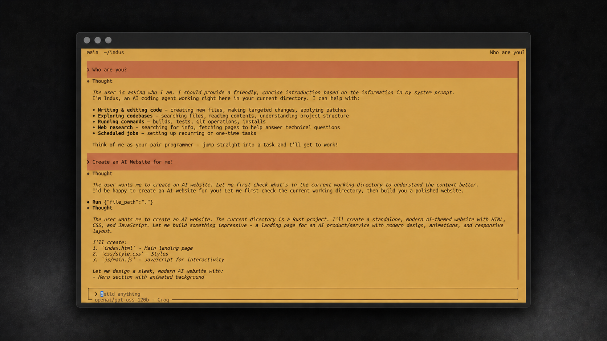

<div align="center">

<h1>
  
  <br>
  Indus (<code>indus</code>)
</h1>

**Indus** is **India's first AI-native command-line (CLI) coding agent**, built by
**Mantra [[MCIAIR](https://mciair.in)]**. It brings a full-screen, mouse-aware
TUI together
with an agent harness that can understand repositories, edit files, run
commands, search the web, manage sessions, and carry long-running work forward.

[Installing the released binary](#installing-the-released-binary) ·
[Building from source](#building-from-source) ·
[Capabilities](#capabilities) ·
[Compatible Interim Providers](#compatible-interim-providers) ·
[Documentation](#documentation) ·
[Repository layout](#repository-layout) ·
[Development](#development) ·
[License](#license)



**Read the full documentation at [docs.mciair.in](https://docs.mciair.in).**

Indus is designed as a focused workspace for building software from the
terminal: conversations stream in place, tool runs stay inspectable, file diffs
remain visible, and saved sessions can be resumed without losing context.

</div>

---

## Installing the released binary

Install the latest native binary on macOS, Linux, or Git Bash:

```sh
curl -fsSL https://mciair.in/indus/cli/install.sh | bash
```

Install on Windows PowerShell:

```powershell
irm https://mciair.in/indus/cli/install.ps1 | iex
```

Or install through npm:

```sh
npm install --global indus-cli
```

Verify the installation, then launch the TUI:

```sh
indus --version
indus
```

## Building from source

### Requirements

- A current stable [Rust toolchain](https://www.rust-lang.org/tools/install)
- Git
- A native C/C++ build toolchain for Rust dependencies
- An API key for one of the supported Compatible Interim Providers

```sh
git clone https://github.com/mciair/indus.git
cd indus
cargo install --path .
indus
```

For local development, launch the TUI directly:

```sh
cargo run
```

On first use, enter `/model` to open the provider catalog, choose a model, and
enter its provider API key. Indus stores the selection locally and reuses the
most recently selected model on the next launch.

To continue a saved conversation:

```sh
indus --resume ses-i_your-session-id
```

Indus allocates a session only after the first model response. When you quit an
allocated session, the terminal prints the exact resume command.

## Capabilities

- **Repository-aware agent harness** — reads and searches code, writes targeted
  edits, applies patches, runs shell commands, and presents structured diffs.
- **Streaming terminal experience** — renders responses, Markdown, reasoning,
  tool activity, elapsed work states, and collapsible execution details in place.
- **Durable sessions** — supports resume, rename, rewind, ephemeral forks,
  transcript export, timelines, prompt history, and session deletion.
- **Controlled execution** — cycles between Normal, Plan, and Always Approve
  modes, with explicit permission handling for consequential tool calls.
- **Context management** — compacts automatically near the context threshold,
  while `/compact` allows an intentional compaction at any time.
- **Background work** — supports queued prompts and persistent scheduled Jobs.
- **Extensible workflows** — discovers MCP servers, skills, and project or user
  workflows from the terminal.
- **Developer ergonomics** — includes themes, Vim input, multiline prompts,
  selectable scrollback, prompt recall, side questions, usage details, and
  environment diagnostics.

### Essential controls

| Control | Action |
|---|---|
| `Ctrl+Q` | Quit Indus |
| `Ctrl+U` | Open Meet Alpha |
| `Shift+Tab` | Cycle Normal, Plan, and Always Approve modes |
| `Ctrl+E` | Expand or collapse reasoning |
| `Up` / `Down` | Recall previously sent prompts |
| `Page Up` / `Page Down` | Move through transcript scrollback |
| `/` | Browse commands and their arguments |

Command-line information is available without opening the TUI:

```sh
indus --help
indus --version
```

Useful starting commands include `/model`, `/resume`, `/new`, `/plan`,
`/view-plan`, `/usage`, `/doctor`, `/skills`, `/mcps`, `/workflows`, and
`/release-notes`.

## Compatible Interim Providers

Mantra, MCIAIR's foundational model, is still in development. Until it becomes
available, Indus uses the following providers as **Compatible Interim
Providers** so the platform remains usable with current models:

| Provider | Model discovery |
|---|---|
| OpenAI | Fetched from the provider catalog |
| Anthropic | Fetched from the provider catalog |
| Google Gemini | Fetched from the provider catalog |
| Groq | Fetched from the provider catalog |
| OpenRouter | Fetched from the provider catalog |

Selecting a provider opens its model catalog. Available models, context-window
metadata, tool support, and reasoning-effort options are derived from provider
metadata when exposed. API keys and recent model preferences are persisted
locally with restricted file permissions.

> [!NOTE]
> Indus does not collect your prompts, code, API keys, or session history.
> Requests to a model are sent only to the Compatible Interim Provider you
> select.

## Documentation

The complete user guide is available at
[docs.mciair.in](https://docs.mciair.in), including model setup, sessions,
keyboard controls, slash commands, themes, permissions, tools, skills, MCP
servers, workflows, Jobs, and troubleshooting.

## Repository layout

| Path | Contents |
|---|---|
| `src/main.rs` | Terminal lifecycle, input routing, and application command dispatch |
| `src/app.rs` | TUI state, sessions, transcript behavior, commands, and interaction logic |
| `src/ui.rs` | Full-screen rendering, Markdown, diffs, cards, catalogs, and popovers |
| `src/harness/` | Agent runtime, model transport, tools, permissions, persistence, Jobs, and compaction |
| `src/provider.rs` | Provider discovery, API-key storage, model selection, and reasoning metadata |
| `src/slash.rs` | Slash-command catalog, completion, and argument suggestions |
| `src/theme.rs` | Indus themes and terminal color definitions |
| `docs/assets/` | README brand and interface assets |

## Development

```sh
cargo fmt -- --check
cargo check --tests
cargo clippy --tests -- -D warnings
cargo test
```

Keep changes focused and include tests for new harness, state, input, or
rendering behavior. The project uses Rust 2024 edition and treats Clippy
warnings as errors during verification.

## License

Indus is licensed under the **Apache License, Version 2.0**. See
[`LICENSE`](LICENSE) for the full license text.
